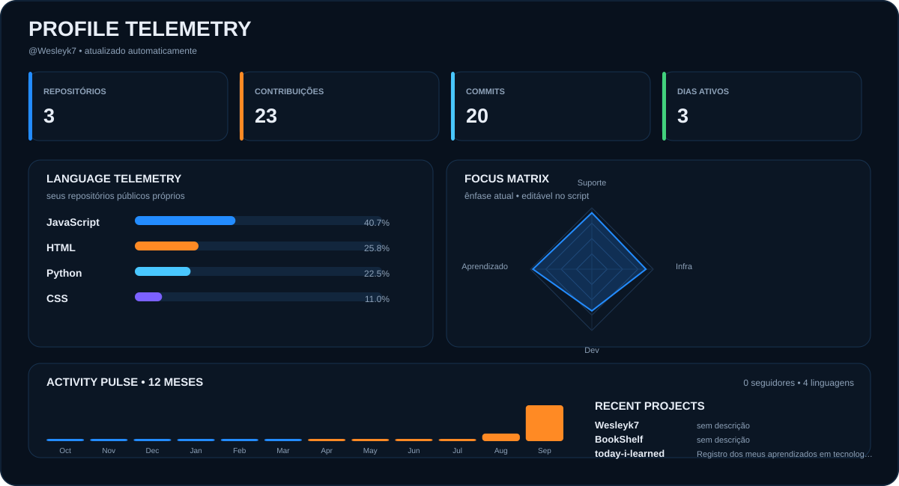

  

---

## 👨‍💻 Sobre mim

> Estudante de **Análise e Desenvolvimento de Sistemas**, com interesse em **Suporte Técnico, Infraestrutura e Desenvolvimento**.  
> Gosto de resolver problemas, aprender novas tecnologias e transformar conhecimento em soluções práticas.

---

## 🛠️ Tecnologias e Ferramentas

  

  HTML • CSS • Python • Git • GitHub • VS Code

---

## 🚀 Projetos e Aprendizados em destaque

### 📚 Repositório de Aprendizados

Registro dos meus estudos, anotações e exemplos práticos de programação.

`Git` `GitHub` `HTML` `CSS` `Python`

➡️ [Ver repositório](COLE_AQUI_O_LINK)

 

### 🌐 BookShelf

Projeto desenvolvido durante meus estudos utilizando HTML, CSS e JavaScript.

`HTML` `CSS` `JavaScript`

➡️ [Ver projeto](COLE_AQUI_O_LINK)

---

## 📊 Minha evolução no GitHub

  

---

## 📫 Contato

---

  <b>Aprender. Praticar. Evoluir.</b>

---

  <b>Aprender. Praticar. Evoluir.</b>

